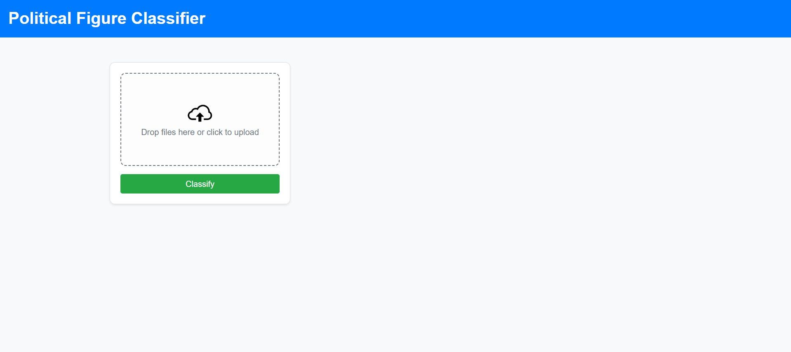
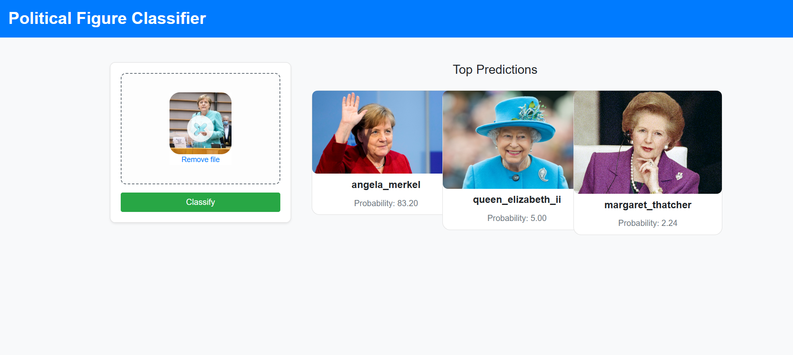
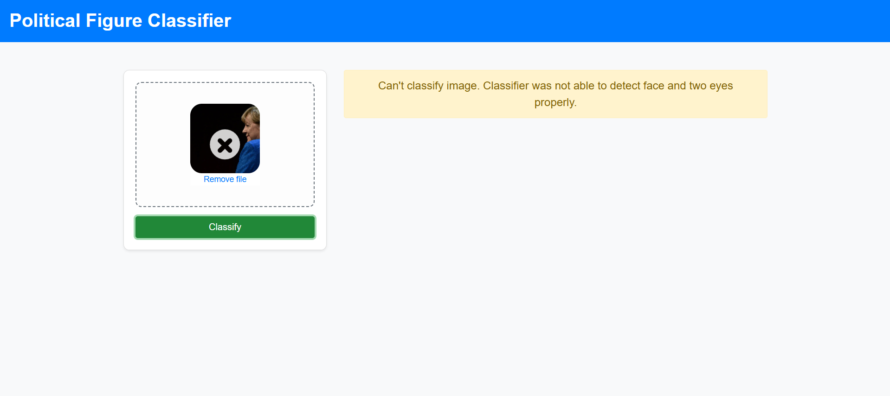

# Project: Political Figure Image Classifier

## Table of Contents

- [Project Overview](#project-overview)
- [Demo](#demo)
- [Software & Libraries Used](#software--libraries-used)
- [Dataset & Model](#dataset--model)
- [Limitations & Future Improvements](#limitations--future-improvements)
- [Installation & Setup](#installation--setup)

---

<h2 id="project-overview">Project Overview</h2>
Recognizing political figures in images is a complex task that combines computer vision and deep learning. This project builds an image classification model that identifies well-known political figures based on facial features. The goal is to develop an AI-powered tool that can analyze an uploaded image and predict which political figure it contains.

---

<h2 id="demo">Demo</h2>

#### 1️⃣ Uploading an Image
The application allows users to upload an image of a political figure.



#### 2️⃣ Classification Result
Once uploaded, the model predicts the political figure with confidence scores.



#### 3️⃣ Error Handling
If no face is detected in the uploaded image, the application displays an error message.



---

<h2 id="software--libraries-used">Software & Libraries Used</h2>

This project utilizes various tools and libraries for machine learning, backend development, and frontend integration.

### 📌 Machine Learning
- **NumPy** – Numerical computations
- **OpenCV** – Image processing  
- **Scikit-Learn** – Model training & evaluation  
- **Matplotlib & Seaborn** – Data visualization  
- **Joblib** – Model saving & loading  

### 🖥 Backend
- **Flask** – Web framework for serving the model  
- **Jupyter Notebook** – Used for model development  

### 🌐 Frontend
- **HTML, CSS, JavaScript** – User interface  
- **Live Server (VS Code)** – Local development server  

---

<h2 id="dataset--model">Dataset & Model</h2>

### 🖼 Dataset
The dataset consists of images of political figures, which were scraped from **Google Images**. To ensure a diverse dataset, images were collected from various sources, covering different angles, lighting conditions, and backgrounds. The images were then preprocessed to enhance model performance.

### 🏗 Model
The classification model was built using **Scikit-Learn** with different machine learning algorithms. The final pipeline includes:  
- **Feature Extraction**: Images were processed using **OpenCV** and **Wavelet Transforms** to extract facial features.  
- **Model Training**: Multiple classifiers were tested, including:
  - **Support Vector Machine (SVM)**
  - **Random Forest**
  - **Logistic Regression**  
  The best-performing model was selected based on classification accuracy.  
- **Evaluation**: Performance was assessed using metrics like **confusion matrix**, **precision**, and **recall**.  

---

<h2 id="limitations--future-improvements">Limitations & Future Improvements</h2>

### ⚠️ Limitations
- **Limited Recognition Scope**: The model is currently trained to recognize only **around 20 political figures**. This restricts its ability to classify a wider range of individuals.  
- **Face Detection Issues**: At times, the model **fails to detect a face**, even when one is clearly visible. This can be due to variations in lighting, image quality, or pose.  
- **Model Bias**: Since the dataset was scraped from Google Images, it may contain biases based on image availability and source diversity.  

### 🚀 Future Improvements
- **Expand Dataset**: Increase the number of political figures and collect more diverse images to improve recognition accuracy.  
- **Enhance Face Detection**: Implement a more advanced face detection model, such as **MTCNN** or **Dlib**, to reduce false negatives.  
- **Improve Model Performance**: Experiment with **deep learning models** (e.g., CNNs using TensorFlow/PyTorch) to enhance classification accuracy.  

---

<h2 id="installation--setup">Installation & Setup</h2>

Follow these steps to set up and run the project locally.

### Prerequisites
Ensure you have the following installed on your system:
- Python 3
- pip (Python package manager)
- Virtual environment (optional but recommended)
- VS Code with the Live Server extension

#### 1️⃣ Clone the Repository
```bash
git clone https://github.com/Zakir09/Image_Classification.git
```

#### 2️⃣ Create and Activate Virtual Environment (Optional)
```bash
# On macOS/Linux
python3 -m venv venv
source venv/bin/activate

# On Windows
python -m venv venv
venv\Scripts\activate
```

#### 3️⃣ Install Dependencies
```bash
pip install -r model/requirements.txt
```

#### 4️⃣ Run the Flask Server for Application
```bash
python server.py
```

#### 5️⃣ Open the Project in VS Code
Launch VS Code, then open the project folder.

#### Run the Application Using Live Server
1. Open index.html in VS Code.
2. Right-click anywhere in the editor and select "Open with Live Server".
3. This will launch a local server at:
```bash
http://127.0.0.1:5500/
```

